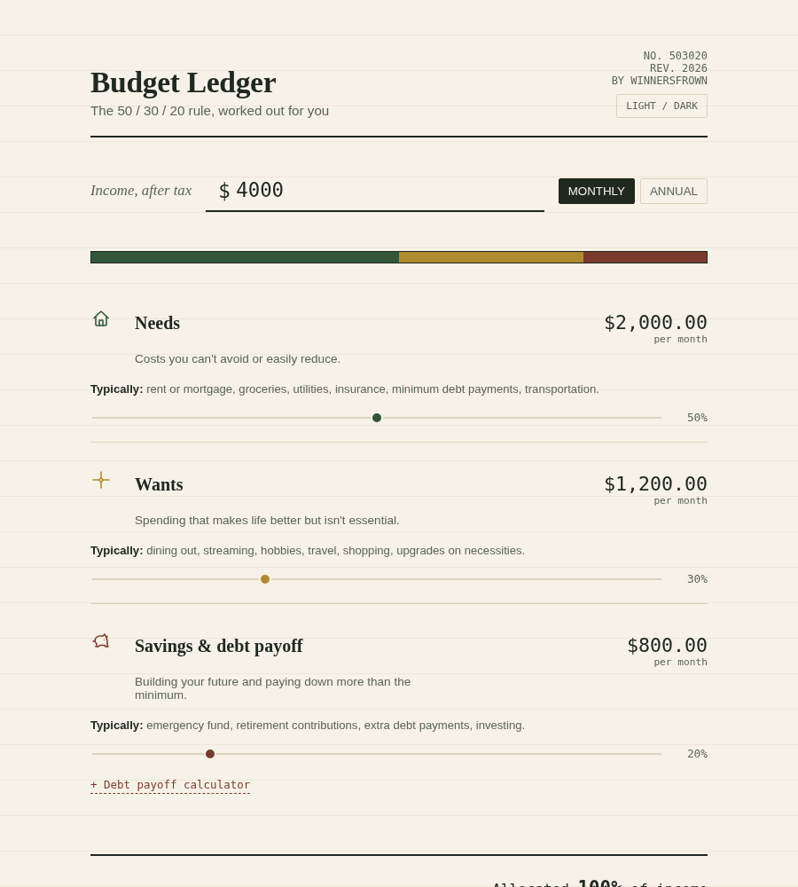
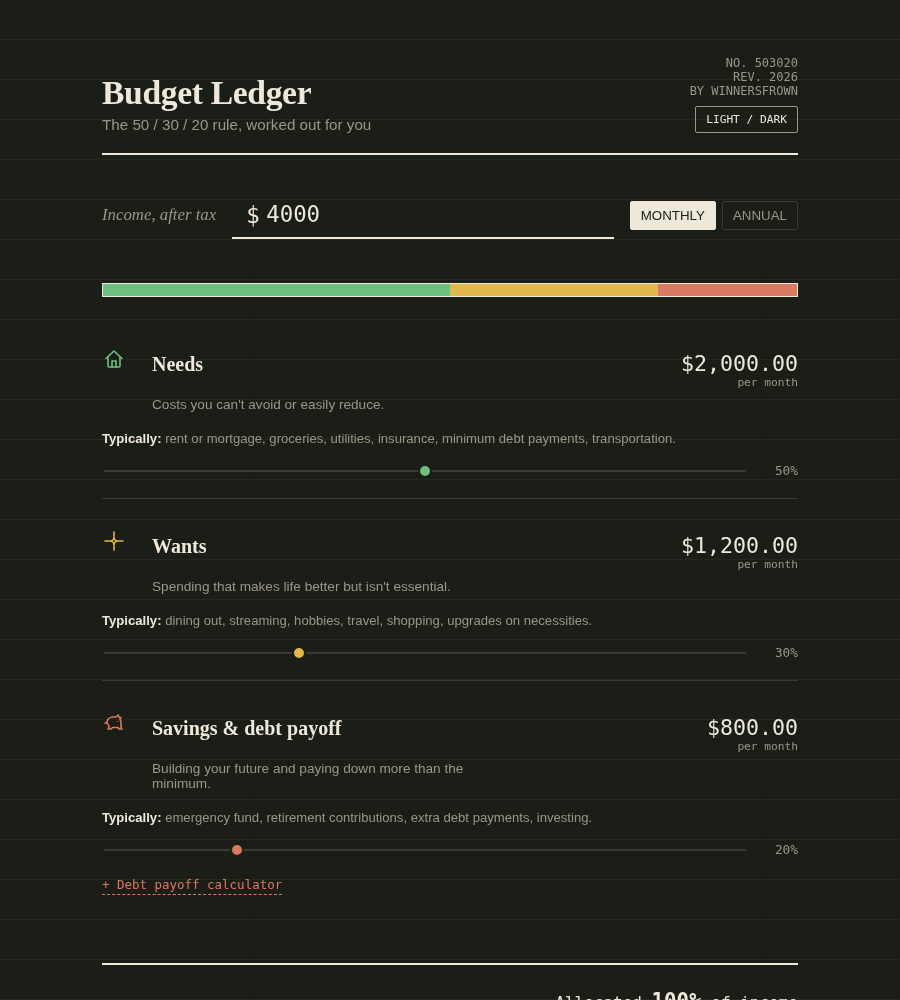

# Budget Ledger — 50/30/20 Calculator

A single-page, no-build calculator for the 50/30/20 budgeting rule: 50% needs, 30% wants, 20% savings & debt payoff. Drag any slider and the other two rebalance automatically so the ledger always totals 100%.



<details>
<summary>Dark mode</summary>



</details>

## How the math works

The 50/30/20 rule is a simple way to split your **after-tax income** into three buckets:

- **50% Needs** — costs you can't easily avoid: rent/mortgage, groceries, utilities, insurance, minimum debt payments, transportation.
- **30% Wants** — spending that improves quality of life but isn't essential: dining out, streaming, hobbies, travel, shopping.
- **20% Savings & debt payoff** — building your future: emergency fund, retirement contributions, investing, and paying down more than the minimum on debt.

The calculator takes your income and multiplies it by each percentage:

```
Needs   = income × 0.50
Wants   = income × 0.30
Savings = income × 0.20
```

Move any slider and the other two rebalance proportionally, so all three always add up to 100% of your income — you're never allocating more (or less) than you actually make.

The built-in **debt payoff calculator** (inside the Savings section) takes your current Savings allocation as a monthly payment and estimates how long it'll take to clear a given balance at a given interest rate, using the standard loan amortization formula:

```
months = -ln(1 - (r × P) / A) / ln(1 + r)
```

where `r` is the monthly interest rate, `P` is the balance, and `A` is the monthly payment.

## Notes

- Fonts load from Google Fonts over CDN; the page still works offline, falling back to system fonts.
- No analytics, no external scripts, no data leaves the browser — all math happens client-side.

## License

MIT — see [LICENSE](LICENSE). Do whatever you like with it.
